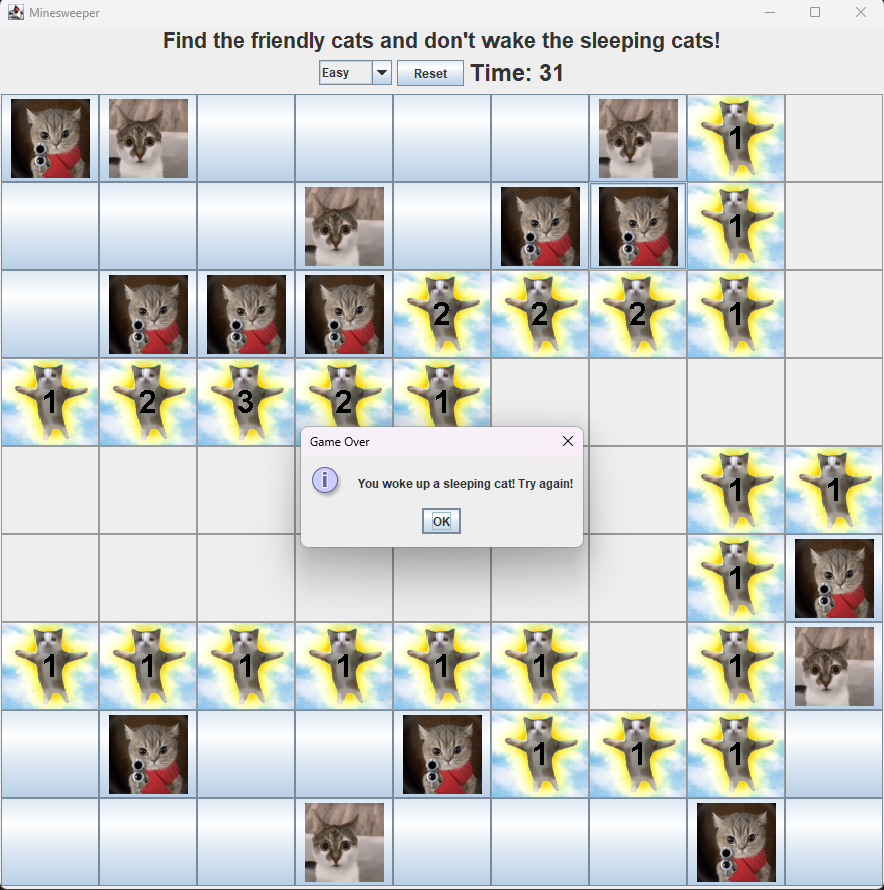

# Cat Minesweeper!

A cat-themed Minesweeper game built with Java Swing. 

Red cat -> Bomb

Nervous cat -> Flag

This project started as an old Java Minesweeper clone that I originally built while learning Java. I came back to it later to clean up the code and turn it into a more complete and maintainable project.

The result is classic Minesweeper, except you're trying to find the friendly cats without waking the sleeping ones.

## Features

- Classic Minesweeper gameplay
- Cat-themed game board
- First-click safety
- Automatic clearing of empty areas
- Right-click to place and remove flags
- Responsive cell images and numbers
- Game timer
- Reset button
- Multiple difficulty levels
- Win and loss detection
- Resizable game window

## Difficulty Levels

| Difficulty | Board Size | Mine Density |
|-------------|------------|--------------|
| Easy | 9 × 9 | 12% |
| Medium | 16 × 16 | 15% |
| Hard | 24 × 24 | 17% |

## How to Play

The goal is to reveal all of the friendly cats without waking any sleeping cats.

- **Left-click** a cell to reveal it.
- **Right-click** a cell to flag or unflag it.
- Numbers indicate how many sleeping cats are adjacent to that cell.
- Empty areas are revealed automatically.
- Your first click and its surrounding cells are always safe.
- Reveal every safe cell to win.

## Running the Game

### Requirements

- Java

Clone the repository:

~~~bash
git clone https://github.com/james-hutchings/Minesweeper.git
cd Minesweeper
~~~

Compile and run the project using your Java IDE.

> A packaged executable/JAR may be added as a future release.

## Project Structure

~~~text
src/
├── main/
│   └── resources/
│       └── images/
│           ├── bomb.jpg
│           ├── flag.jpg
│           └── happyCat.jpg
└── mineSweeper/
    ├── Difficulty.java
    ├── MineSweeperButton.java
    ├── MineSweeperFrame.java
    ├── MineSweeperPanel.java
    └── MineSweeperProgram.java
~~~

## Why This Project Exists

This began as one of my older Java projects. Revisiting it provided an opportunity to refactor code I wrote much earlier and apply better software design practices.

The original version relied heavily on hard-coded board dimensions and separate logic for corners and edges. The current version uses reusable boundary checking, configurable board sizes, cleaner game state management, responsive rendering, and a simpler separation of responsibilities between the UI components.

And, obviously, cats. 🐱

## Future Ideas

- Custom board sizes
- Configurable number of sleeping cats
- High scores / best times
- Improved cat artwork and UI styling
- Sound effects
- Packaged JAR or desktop executable
- Additional themes

## Built With

- Java
- Java Swing / AWT

## Author

**James Hutchings**
